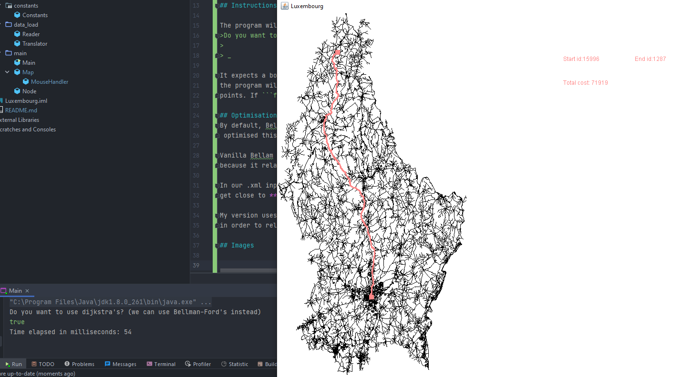
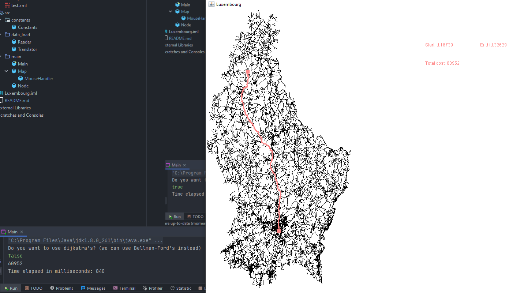

# Luxembourg
Luxembourg map traversal in Java using Dijkstra's and Bellam Ford algorithms

## Description

One of the homeworks at a Graph Theory course I took required us to compute the 
shortest path between two points on the map of Luxembourg. We were given the input
data as a massive xml file consisting of ```nodes``` and ```edges``` and our task
was to translate the latitude and longitude values into pixels on the screen, to
plot them and let the user choose two points on the map, the points to be chosen would
be the closest to where the mouse clicks.

## Instructions

The program will prompt you with the question
>Do you want to use dijkstra's? (we can use Bellman-Ford's instead)
> 
> _

It expects a boolean(```true```/```false```) value. If ```true```, 
the program will use Dijkstra's to find the shortest path between two user-chosen
points. If ```false```, it will use Bellman-Ford's algorithm instead. 

## Optimisations
By default, Bellam-Ford performs way worse than Dijkstra's. I
 optimised this algorithm in order to get _almost_ the same performance. 

Vanilla Bellam Ford takes minutes(or even hours) to compute the shortest path
because it relaxes every edge for n times when n is the number of nodes.

In our .xml input there's around 40.000 nodes and 120.000 edges, this means we 
get close to **5 billion** operations to compute.

My version uses a ```queue``` and only adds the edges connected to a certain node
in order to relax the edges(you could argue that this is a BFS'd Bellam Ford).

## Images



